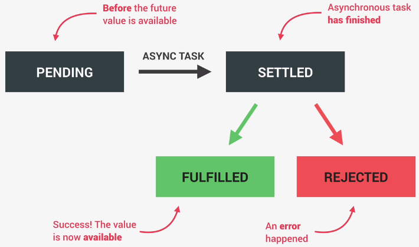

# **Javascript**

## **Promise**

* Object that is used as a **placeholder** for the **future result** of an **async operation** - **Promise**
  * A lottery ticket can be considered a metaphor for promise i.e. we may get a prize and we may not, a lottery ticket is a "promise" of a prize which may get fulfilled or not (rejected)
* We **NO** longer need to **rely on events** and **callbacks** passed into async functions to handle async results
* Instead of nesting callbacks, we can **chain promises** for a sequence of async operations **escaping callback hell**
* Promises are an **ES6** feature (2016)

### **Promise Lifecycle**



### **Consuming Promises**

```javascript
const getCountryData = country =>
  fetch(`${baseUrl}/name/${country}`)
    .then(response => response.json())
    .then(data => renderCountry(data[0]));

getCountryData('Pakistan');
```

> Using promises get rid of callback hell, not callbacks

### **Promise Chaining**

```javascript
const getCountryData = country =>
  fetch(`${baseUrl}/name/${country}`)
    .then(response => response.json())
    .then(data => {
      renderCountry(data[0]);
      console.log(data[0]);
      const neighbour = data[0].borders?.[0];

      if (!neighbour) return;

      return fetch(`${baseUrl}/alpha/${neighbour}`);    // Returning a promise from promise
    })
    .then(response => response.json())    // Consumed here
    .then(data => renderCountry(data, 'neighbour'));

getCountryData('Pakistan');
```

### **Handling Rejected Promises**

* Either we can use a `catch` method or pass a second argument to the `then` method to handle `rejected` promises

```javascript
const getCountryData = country =>
  fetch(`${baseUrl}/name/${country}`)
    .then(response => response.json())
    .then(data => renderCountry(data[0]))
    .catch(err => console.log(err));      // Method 1

getCountryData('Pakistan');
```

```javascript
const getCountryData = country =>
  fetch(`${baseUrl}/name/${country}`)
    .then(
      response => response.json(),
      err => console.log('err', err)      // Method 2
    )
    .then(data => renderCountry(data[0]));

getCountryData('Pakistan');
```

### **`finally`**

* It is called at the **end** of a promise whether it is **successful or not**

```javascript
const getCountryData = country =>
  fetch(`${baseUrl}/name/${country}`)
    .then(response => response.json())
    .then(data => renderCountry(data[0]))
    .catch(err => console.log(err))
    .finally(() => console.log('promise ended'));

getCountryData('Pakistan');
```

### **Creating Promises**

* The `Promise` constructor takes in two arguments, a `resolve` and `reject` function
* `resolve` is called when the promise is successful
* `reject` is called when the promise is not successful

```javascript
const lotteryPromise = new Promise(function (resolve, reject) {
  console.log('Lottery draw is happening 🔮');
  setTimeout(() => {
    if (Math.random() >= 0.5) {
      resolve('You WIN 💰');
    }
    reject(new Error('You lost your money 💩'));
  }, 2000);
});

lotteryPromise
  .then(res => console.log(res))
  .catch(err => console.error(err));
```

### **Promisifying Callbacks**

```javascript
// Promisifying setTimeout
const wait = function (seconds) {
  return new Promise(function (resolve) {
    // setTimeout expects a callback, in this case
    // which would be the `resolve` function.
    // There is no need to reject in this scenario
    setTimeout(resolve, seconds * 1000);
  });
};

wait(1)
  .then(() => {
    console.log('1 second passed');
    return wait(1);
  })
  .then(() => {
    console.log('2 second passed');
    return wait(1);
  })
  .then(() => {
    console.log('3 second passed');
    return wait(1);
  })
  .then(() => console.log('4 second passed'));

// Previously written as below using callbacks

// setTimeout(() => {
//   console.log('1 second passed');
//   setTimeout(() => {
//     console.log('2 seconds passed');
//     setTimeout(() => {
//       console.log('3 second passed');
//       setTimeout(() => {
//         console.log('4 second passed');
//       }, 1000);
//     }, 1000);
//   }, 1000);
// }, 1000);
```

```javascript
// Promisifying the Geolocation API

// Before
navigator.geolocation.getCurrentPosition(
  position => console.log(position),
  err => console.error(err)
);

// After
const getPosition = function () {
  return new Promise(function (resolve, reject) {
    // navigator.geolocation.getCurrentPosition(
    //   position => resolve(position),
    //   err => reject(err)
    // );
    navigator.geolocation.getCurrentPosition(resolve, reject);
  });
};
getPosition().then(pos => console.log(pos));
```

### **Running promises in Parallel**

* `Promise` has a few methods with which we can run promises in parallel
  * `all` - Will fulfill promise when all input promises are fulfilled. If any one promise fails, it short-circuits and rejects
  * `race` - The returned promise settles (resolves or rejects) with the eventual value of the first input promise that settles
  * `allSettled` - Will settle when all input promises are settled
  * `any` - Will fulfill promise if any of the input promises are fulfilled. If all input promises fail, it will fail as well
* They receive an array of promises, and return a promise with the results of each promise (as an array)
* 

```javascript
const waitAll = await Promise.all([wait(1), wait(2), wait(3)]);
console.log(waitAll);

// or

(Promise.all([wait(1), wait(2), wait(3)])).then(res => console.log(res))
```