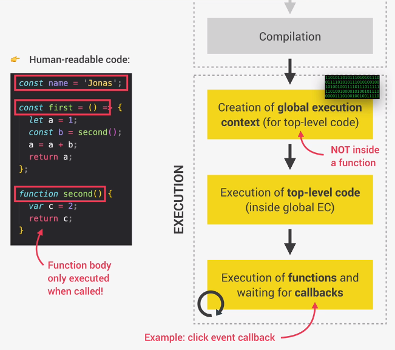
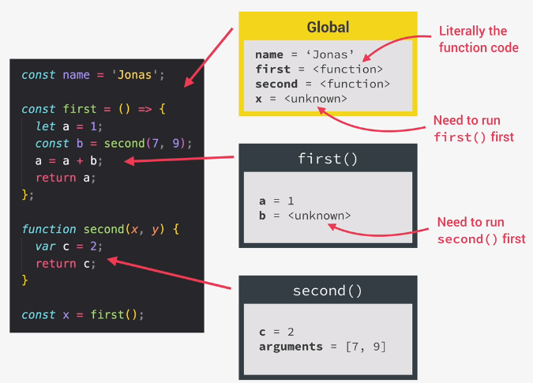

# **Javascript**

## **Execution Context**

* Environment in which a piece of Javascript is executed
* It stores all the necessary information for some code to be excuted

> Pizza coming in a delivery box with receipt and cutlery is a metaphor of execution context where pizza is the javascript code and the rest is the execution context

* There is exactly **one** global execution context; created for **top-level code**

> **Top-level code** - Code which is not inside any function

* Each function call has a new execution context created for it
* These execution contexts all together form the [**call stack**](#call-stack)

### **Execution Context in detail**

* Execution context of a function contains the following:
  1. Variable Environment
     1. `let`, `const` and `var` declarations
     2. Functions
     3. **arguments** object - Not available for arrow functions
  2. Scope chain
  3. `this` keyword - Not available for arrow functions
* This is generated during "creation phase", right before execution

## **Call Stack**

* "Place" where execution contexts get stacked on top of each other, to keep track of where we are in the execution

### **What happens when a function is called?**

* Execution context of a function is moved onto the call stack when it starts executing and is popped off the stack when something is returned from it
* When a function starts executing after its execution context is pushed to the call stack, the previous function from which it was called has its execution paused
* Initially, the global execution context is pushed onto the stack so it is the last thing to pop off from the stack; it happens when we exit from the browser env

