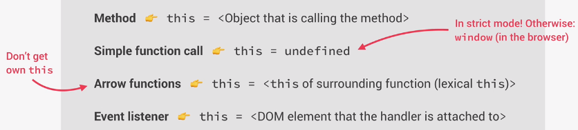

# **Javascript**

## **`this` keyword**

* Special variable that is created for every execution context (every function) - **`this` keyword/variable**
* Takes the value of (points to) the "owner" of the function in which the `this` keyword is used
* `this` is **NOT** static. It depends on **how** the funciton is called, and its value is only assigned when the function **is actually called**

* **Value of `this` keyword** in different circumstances:

> **`this`** does **NOT** point to the function itself, and also **NOT** its variable environment