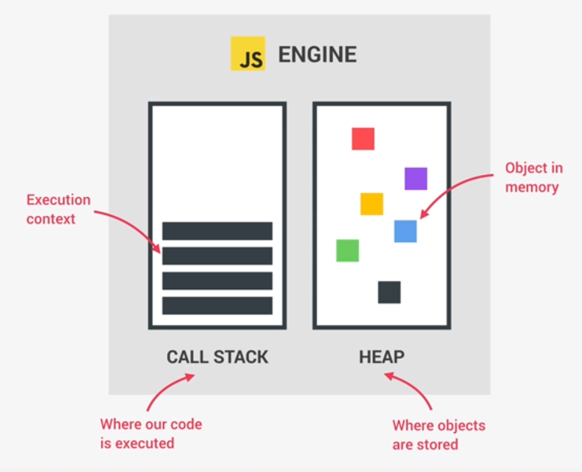

# **Javascript**

## **Javascript Engine**

* Program which executes javascript code
  * e.g. V8 Engine for NodeJS and Google Chrome
* Contains a `call stack` and a `heap`
  * Call stack has an execution context where code is executed
  * Heap is an object in memory where objects are stored

  Compilation Vs. Interpretation

  > **Compilation** - Entire code is converted into machine code at once, and written to a binary file that can be executed by a computer.
  >
  > **Interpretation** - Interpreter runs through the source code and executes it line by line.
  >
  > **Compilation** >>>> **Interpretation** (in terms of speed)

> **Just-in-time (JIT) compilation** - Entire code is converted into machine code at once, then executed immediately.
>
> Javascript uses this approach.
